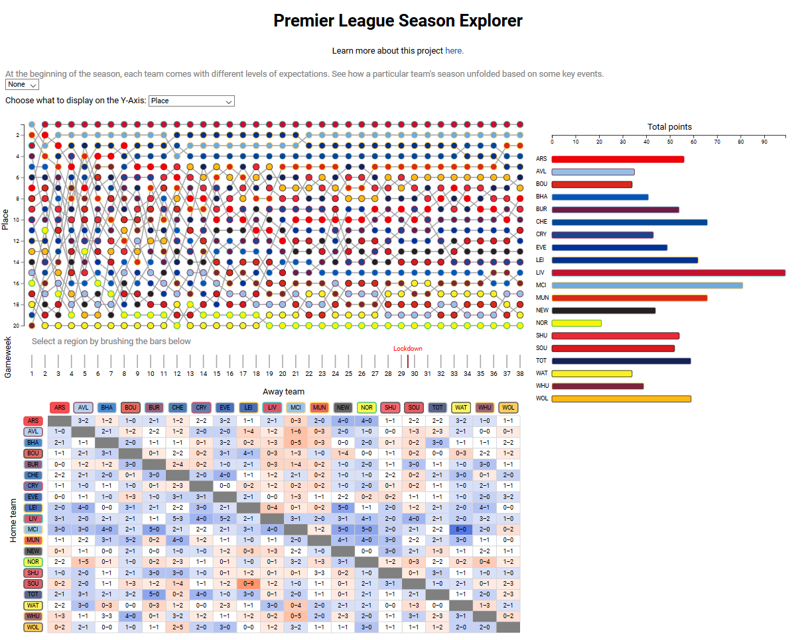

# Process book
 
Premier League Season Explorer
 
 
## Overview and Motivation
 
It’s easy to tell who wins the Premier League at the end of the year, but how did they get there? What were the challenging games that could have broken their championship season? What were their best games? 
 
What about the other teams, who won the alternative tables? If you look at just the Christmas games, the first half of the season, the post-lockdown games, who would have come out on top?
 
Finally, 2019/2020 was a big year for manager changes. We’ll show the “eras” of the managers and answer questions about whether it was necessary to sack them in the first place. How did the new guy compare?
 
We all have an interest in soccer, while Jakob and Brian religiously follow the Premier League. Thus, we decided to choose this project as playing to our interests. All of us love looking for trends in data, with a particular interest in sports data.
 
 
## Related Work
 
You can use many sites to visualize individual Premier League games (e.g., *The Guardian* and the official Premier League site). Some websites can be used to visualize an entire season (again, the official Premier League site can do this). But there are not many sites out there that make it easy to visualize part of a season or easily switch between game data and season data.
 
 
## Questions and Goals
 
Our main goal is to interactively visualize a single English Premier League (EPL) season with a game-by-game breakdown for all EPL teams.
 
We show how each team performed versus other teams and as a function of time over the entire season. We also allow the user to zoom in on individual games and see the significant events during each game, such as when a player scored or was shown a red card.
 
Also, we tell stories about the season in a by-team view. For example, show when a manager was sacked and compare performance on either side of this event, or see when a team played a champions league match and whether it seemed to affect their performance in league matches.
 
Aside from our objectives in creating a suitable visualization for the data, we would like to utilize this time to learn more JavaScript/D3/programming techniques that we will utilize in our chosen career paths post-graduation. We would like to learn how to create an effective visualization and wrangle data into appropriate forms from scratch, using our creativity and knowledge without relying on visualization templates or other such interventions from people knowledgeable on the subject. Additionally, we would like to gain experience working as a team while coding: a skill that is not often taught in classes and that we can take advantage of during this project.
 
 
## Data
 
We mainly used CSVs from [FootyStats](https://footystats.org/england/premier-league#), a website with a massive amount of data that can be downloaded. Although we do need to pay for it, it’s only 20 euros per month and we only need it for one month so we all agreed to chip in 1/3 of the cost for the benefit of the project.
 
We also took data from the [Premier League website](https://premierleague.com), useful for data not on the FootyStats site, which in our case turned out to be gameweek, goal scorers, and red cards. However, there is no data dump download option that we were aware of, so we had to input the data into a JavaScript-readable format manually, which took a significant amount of time.
 
 
## Exploratory Data Analysis
 
Thus far, the season data downloaded from FootyStats has worked well for implementing the bump chart, season summary chart, and game table. The only data we needed to add to the CSV file to make this work was gameweek, which was almost trivial to implement. There was also no column for cumulative points on the season, but it was easy to implement a JavaScript function to calculate this number of points for the season summary chart. Similarly, there was no column for margin of victory (used for saturation/hue in the game table), but this was easy to calculate on the fly in the visualization from the home team and away team goals. We then calculated the placement on the table on a given gameweek using the total number of points up to that point, using goal differential (goals for - goals against) and goals for to break ties in keeping with the official Premier League rules. Should two teams still be tied, we used alphabetical order to break the tie, as it would be difficult to show two teams occupying the same place on the table, how the Premier League website and other sites break these ties when showing tables.
 
One wrinkle we came across midway through the project is that the FootyStats data does not include anything about individual players (e.g., who cards, subs, goals broken down by player). Thus, we were forced to manually grab player data from the Premier League website game by game. As a result, we limited our game detail view to only include game-changing events (goals and red cards), as any more than this (in particular full lineups and substitutions) would require an excessive amount of work to input the data.
 
 
## Design Evolution
 
So far, we are sticking mostly to our original designs, apart from the game detail view for the reasons mentioned above. The season summary chart is still a horizontal bar chart with team encoded by both vertical position and hue, and the game table is still an adjacency matrix with a diverging color scale for margin of victory. The bump chart is still 20 superimposed line charts, with team encoded by the hue of the dots.
 
We did, however, make some major changes to the game detail view. The most notable of these is that we decided to juxtapose rather than superimpose the game detail view. When designing the page there was extra unused space in the bottom right and juxtaposing the game detail view to this space rather than superimposing it saves the user the effort of closing the superimposed view before selecting a new game to view. As mentioned above, we were also unable to provide full lineups, substitutions, or yellow cards to present in the game detail view due to the lack of a database for such information; it instead lists only goals and red cards (i.e. game-changing events).
 
We also made some more minor aesthetic changes to the other views. We originally colored the bump chart lines by secondary team color, but this caused some teams stand out in the chart much more than others. Thus, we instead changed the line color to be a uniform gray for all teams, eliminating this effect. We also initially used a pure diverging color scale for the game table margin of victory but found that it was difficult to determine the hue of the games with a margin of 1 point due to the colors being so desaturated. We instead continued to use white as the color for a draw, but increased the saturation of all subsequent victory margins (i.e., there is a jump in saturation greater than expected for a pure diverging color scale between a draw and a 1-point margin of victory).
 
Regarding interactivity, we have mostly maintained our original plans of being able to show the game detail of a single game at a time, highlight teams across all three primary views, and select a specific time range of games to display. However, we also enabled the ability to highlight multiple teams at once rather than just one; this allows for easier visualization of, for example, the relegation battle or race for Champions League spots, or allowing a user to highlight their favorite teams if they have multiple. We also realized that we had two competing uses for clicking on the bump chart: opening the corresponding game in the game detail view and highlighting the team across all views. We thus decided that highlighting teams should only be accomplished by clicking on the season summary chart.
 
We were initially going to include the Champions League and relegation places in the bump chart by adding horizontal lines between 17th and 18th (for relegation) and between 4th and 5th (for Champions League). However, we decided that the bump chart was already too cluttered and that adding these features would make it harder to decipher the primary purpose of the chart, which is to show how the teams did throughout an entire season. Readers interested in this info already have it implicitly in the season summary chart immediately to the right even when the brush is activated, as the top four finishers automatically advance to the champions league and the bottom three are relegated.
 
The bump chart animations and x-axis are designed to preserve the full-season context and provide a meaningful x-axis in the zoomed view. 
 
One final minor problem that we ran into is the possibility that the user could brush over a small enough range of games that a team could pick up zero points. While this is mostly fine, it posed a problem for our team selection method, as the bar to click on to select the team would have zero length. To remedy this, we also allowed for clicking on the team names in the points total chart.

 
## Implementation

JavaScript and D3 have suited our needs well. We did not run into any major roadblocks or other significant problems during the process. Coding-wise, we kept our main script.js file reserved only for code that either load in the data to be visualized or is responsible for linking between the different views. We placed all other JavaScript code in the individual JavaScript files for each view.

In the end, we have settled on the design shown above. We chose to juxtapose all the views rather than have only one visible at a time, as there are aspects where being able to observe multiple views is necessary (e.g. viewing how a team's performance over several weeks by brushing on the bump chart causes their overall place in the points total view to change). The justification for our choices of design is as follows in the below subsections:

### Bump chart

The bump chart view uses twenty superimposed line charts, one for each team. The team's position in the league (or other performance metric with interactivity detailed beloow) as a function of game week is shown.

- Superimposed line charts used, since the data is tabular and the number of teams is small enough (20) that juxtaposed line charts are appropriate (20 is on the upper end of the range, but we see it as still acceptable since inherently bump chart the number of line crossings is minimal and we are using two hues for each team).
- X-axis position (position on a single scale) chosen to represent gameweek since it's the independent variable and is the most important attribute
- Y-axis position (position on a single scale) chosen to represent position/points/GD since they're the dependent variables and are the most important dependent attributes. All choices carry similar but distinct information with nothing to be gained from viewing the different variables at the same time, so a menu to switch the displayed y-axis was used.
- Two hues (a primary and secondary) are chosen to represent the team since hue is the next dominant channel after position, but 20 is too many hues for a single encoding to be able to capture. However, by using both primary and secondary team colors, we are able to encode all 20 teams with distinguishable hues representing the team colors.

### Points total

For the total points view, we settled on a simple bar chart. Each bar represents the points total throughout the entire season (or selected gameweek range; see interactivity section below) for each team.

- Bar chart used since there is a single category
- Y-axis position chosen to represent team since it's the dominant sensory input for categorical variables. A redundant encoding of hue is used as well to match the hues used in the bump chart and game detail view in order to allow for easier cross-referencing.
- Length of bars (and hence also position on x-axis since they all start from the same x-value) chosen to represent total points since it's a quantitative attribute and is the most dominant encoding.

### Game table

For the game table view, we settled on the following adjacency matrix, with teams as nodes and games as links. The matrix itself represents a complete graph with directed links in each direction, since every team plays every other team both home and away. However, the usefulness of the adjacency matrix encoding comes from being able to show the margin of victory for all games easily by encoding this value in the hue/saturation of the links using a diverging color scale. The below image sshows the game table with a single game (Newcastle United 3&#x2013;0 Sheffield United) selected by clicking on it (showing it in the game detail view)

- Adjacency matrix network visualization is used for this complete graph network because the attributes of the links (i.e., games) are the important parts, not anything to do with the nodes or the "distance between nodes.”
- Spatial region chosen to encode which teams are playing since it's the most important attribute of this categorical data
- Saturation/hue on a diverging scale chosen to show the margin of victory since it's ordinal data and the position attribute is already taken, and luminance would make it harder to read the text inside.

### Game detail

For the game detail view, we did not use a generic visualization such as an adjacency matrix or a bar graph. Such a single representation would not be a good fit for our data, which, while having a clear structure, varies considerably from game to game. Instead we settled on a custom encoding, by which each half of a game is represented by an axis, and goals and red cards for each team are positioned on that axis to see when each team scored or received a red card. The following game detail view is for Newcastle United 3&#x2013;0 Sheffield United (the same game shown as selected in the above game table view). Red cards are shown by rectangles (resembling the shape of a card), while goals are shown by circles (resembling the shape of a soccer ball). Hovering over either shows which player scored or received the card, in which exact minute, and in which team they played for (the latter of which is also encoded by the color of the card/goal).

- This is a custom visualization that does not correspond to something like a bar chart or a line chart since the data is not easily fit by one of these common visualization types.
- Position is used for the times in the game of goals and red cards since it's the dominant encoding
- Hue is used to show scoring the goal or receiving the red card, since it's a categorical attribute and hue is the next dominant channel after position, and also for consistency with other views. The hues are the same as those used in the bump chart and total points.

### View interaction

To more easily see how certain teams did in relatin to each other, we allowed for the highlighting of one or more teams by clicking on the team's bar or name in the points total views. This grays out the results for all other teams in all three always-visible views.

- Graying out other teams creates a popout effect for the data for the selected team or teams, to make it easier to see just their results.

### Story

Placeholder

**INSERT IMAGE HERE**

- Bullet-point justification
 
## Evaluation

We believe that our visualization helps us answer most of our questions and goals that we had at the start. It is possible to see how teams performed over an entire season, and over any desired section of the season. It is possible to highlight any number of teams to specifically compare their performances, and to zoom in on any individual game to see just how the teams performed in that game. Using the story features, it is possible to see how certain teams performed relative to important events. In addition to answering our content-related questions, we also accomplished our goal of learning how to innovatively and efficiently use JavaScript and D3 to create interactive web-based visualizations, a skill that will benefit us significantly when applying for jobs later in our lives.

That is not to say that our visualization is perfect; there are certainly things that could be improved upon. In particular, being able to select teams (in addition to games) from the bump chart would be nice, but we could not figure out a way to intuitively do so without overloading an action. It would also be nice to be able to sort the points total data by number of points, but we unfortunately did not have time to implement such a feature. Finally, we would have preferred to be able to more eaisly show story elements (e.g. managerial changes) overlain on the visualization while simultaneously allowing for interactivity, but such a setup proved too complex to implement during the time we had available for this project.

Overall, we believe our project, while not perfect, can be considered an overall success, and believe that our visualization works well in terms of accomplishing our goals.
