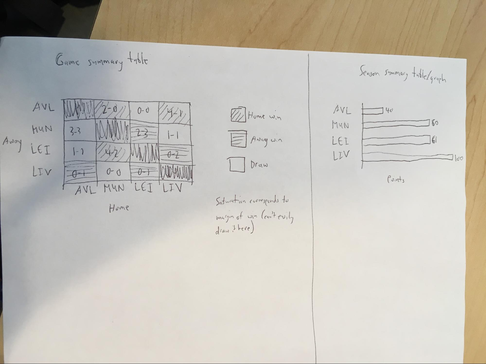
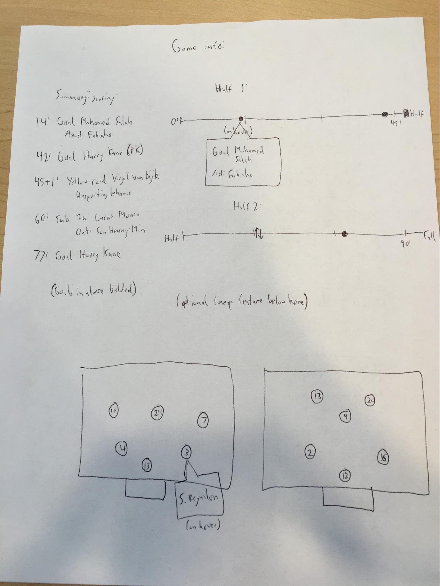
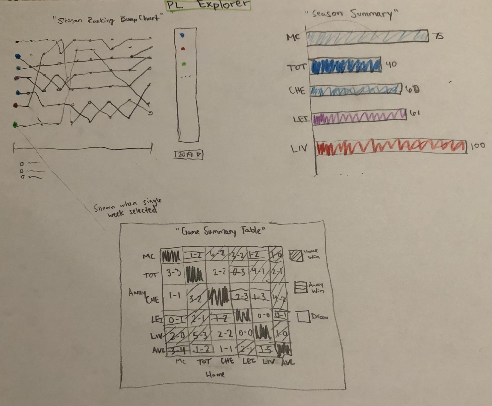
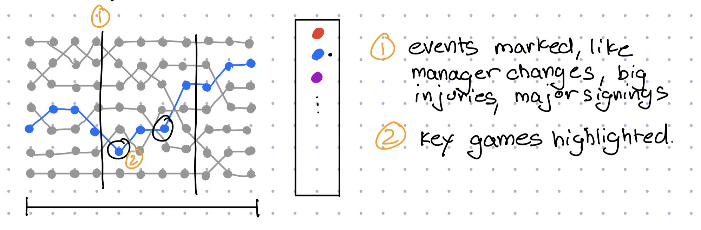
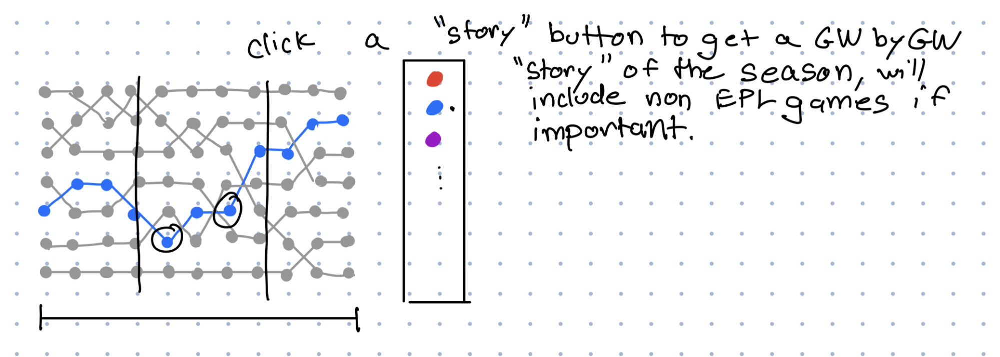
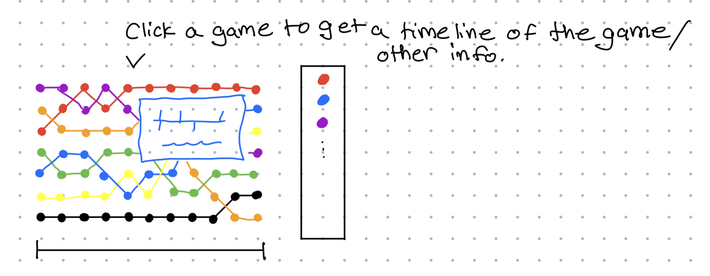
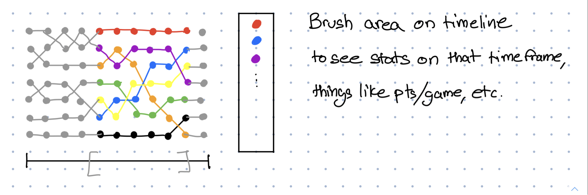
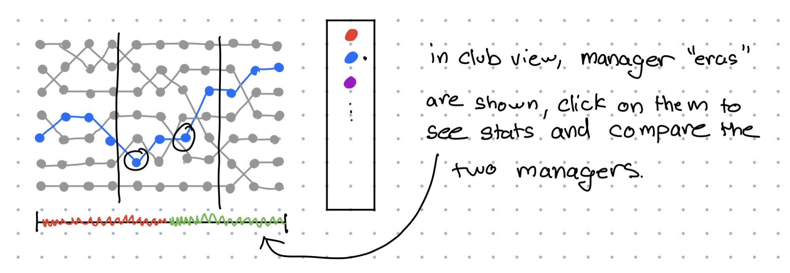

# Proposal -  Premier League Season Explorer

## Basic Info
Title: Premier League Season Explorer  
Brian Eisner, u1269772, <brian.eisner@utah.edu>  
Jakob Johnson, u0972673, <jakobottar@pm.me>  
Kevin Wood, u0658811, <kevin.wood@utah.edu> 

https://github.com/kwood16/pl-season-explorer

## Background and Motivation 
It’s easy to tell who wins the Premier League at the end of the year, but how did they get there? What were the challenging games that could have broken their championship season? What were their best games? 

What about the other teams, who won the #alternativetables? If you look at just the Christmas games, the first half of the season, the post-lockdown games, who would have come out on top?

Finally, 2019/2020 was a big year for manager changes. We’ll show the “eras” of the managers and answer questions about whether it was necessary to sack them in the first place. How did the new guy compare?

We all have an interest in soccer, while Jakob and Brian religiously follow the Premier League. Thus, we decided to choose this project as playing to our interests. All of us love looking for trends in data, with a particular interest in sports data.

## Project Objectives
Interactively visualize a single English Premier League (EPL) season with a game-by-game breakdown for all teams in the EPL.

Show how each team performed versus other teams, and as a function of time over the entire season. Allow the user to zoom in on individual games and see the significant events during each game, such as who scored or who was shown a red card.

Tell stories about the season in by-team view. For example, show when a manager was sacked and compare performance on either side of this event, or see when a team played a champions league match and whether it seemed to affect their performance in league matches.

Aside from our objectives in creating a suitable visualization for the data, we would like to utilize this time to learn more JavaScript/D3/programming techniques that we will utilize in our chosen career paths post-graduation. We would like to learn how to create an effective visualization and wrangle data into appropriate forms from scratch, using our creativity and knowledge without relying on visualization templates or other such interventions from people knowledgeable on the subject. Additionally, we would like to gain experience working as a team while coding: a skill that is not often taught in classes and that we can take unique advantage of during this project.

## Data
Use CSVs from [FootyStats](https://footystats.org/england/premier-league#). This is a website with a huge amount of data that can be downloaded. Although we do need to pay for it, it’s only 20 euros per month and we only need it for one month so we all agreed to chip in ⅓ of the cost for the benefit of the project.

[Premier league website](https://premierleague.com). This will be useful for any data that for some reason isn’t on the footystats site. As far as we’re aware, however, there is no data dump download option, so we will use this as little as possible to minimize unnecessary work of manual data transcription.

## Data Processing
We’ll have a JSON storing information for the bump chart and other by-club information that needs to get loaded right away.

We’ll have individual files for each game because they don’t need to all be loaded at the same time, we can cut down on load time by loading one game’s information at a time. The data will only need to be loaded when that game’s info is being displayed.

We’ll have an additional file storing information about the “stories”, so we can keep the things we need to manually fill in and edit separate from the data acquired from FootyStats. 

The data extracted from FootyStats should not require substantial data cleanup, but we will want to make sure that the data is in an efficient format for D3 to read easily. However, data for the story aspects of the visualization will likely require significant amounts of wrangling to put into appropriate format; there is not a single source that will give us perfectly-formatted CSV or JSON files. We will instead need to create our own, although due to the smaller size of the dataset that will be used for this purpose this should not be a gigantic undertaking.

## Visualization Design
**Keep it as simple as possible!!!!!!!!** This is the main mantra and there is no reason to deviate from it. Show all the data, and only the data.
See at one time only what is necessary. We will want the visualization to be user-friendly so that people do not feel overwhelmed when they see it. However, it must also include all elements listed below, which is a substantial amount. Any game data that does not directly relate to the season as a whole will be hidden by default, and the user must click on an individual game to show it.

Our bump chart will be a line chart with 20 lines, one for each premier league team. For data of this type, a line chart is usually the best choice for a visualization. Although 20 is a bit of a large number for a line chart, team positions in the table as a function of time are not subject to large changes and so the lines will not cross as often as one might expect, and thus a line chart with 20 lines should be readable.

The game summary table will be an adjacency matrix, with the nodes along each axis being the teams and the links being the games. The hue of each game represents the outcome (home win, away win, or draw) and saturation representing the magnitude of the outcome (e.g. a 9-1 win will be much more saturated than a 2-1 win).

The season summary chart will be a simple bar chart, with each bar representing one team and the length of the bar representing total points.

The game info page will utilize several visualization types. To show the game timeline, we will have a line for each half, with important events of the match indicated by marks on the lines. For the optional lineup features, we will aim to visualize half a soccer pitch with each player in the lineup for the given fixture shown in their respective positions and uniform number. By hovering over the number, the player name can be shown.

## Must-Have Features
* “Bump chart”, position in the league as a function of game week. Can click on a dot (match) for more info. The X-axis is game week most likely, rather than date. 

* Selector over a certain number of weeks, to see how the team did relative to others over those weeks only. This will allow us to see when a team is in-form, for example. We should be able to tell that, for example, if the season was only the second half, this team would have won. Can implement this by brushing over an area on the timeline. 

* Season summary table: single table/visualization showing total points at end of the season (or at end of selected season if selector above is chosen). 

* Game summary table: adjacency matrix showing a table of results, 20x20 with each row/column being a team, and can click on a match for more info. Clicking here would also highlight the game in the bump chart, and vice-versa. 

* Game info: info about a specific game. Sort of like what you see in the line (goals, cards, subs) when you select a premier league game on the website. 

* Overall page design: show bump chart, season summary table, and game summary table all at once by default. Will be superimposed on top of other visualizations. 

## Optional Features
* Full lineups for each premier league game in-game info view. Could also add more info in this view as well if we have time for it like formation played.

* Can see in a timeline where the team changed managers, and see how teams did on each side.

* Toggle that can include non-PL (e.g. champions league) games as well, or just have storytelling showing where the teams have played non-PL games

* Would be great to program so it can be extended to other seasons as well. If we have the time, could even add a slider or dropdown at the very top to change the season.

* Scatter/Line chart with raw points values instead of places, useful to visualize the gaps between places/how far ahead Liverpool were. Probably as a toggle with the bump chart; display one or the other but not both at the same time. Maybe also add a selector on the bump chart to make X-axis by date or match played rather than by game week. 

## Project Schedule
1. **Friday, November 6:** Have a basic skeleton of the program done. Basically, at this point it should resemble the code that was given to us prior to homework assignments, with all classes, functions defined, and basic HTML wrapper/div elements created. Data should be loaded in.  
    - **Jakob:** get data, make sure it’s in an appropriate format, and get it loaded in  
    - **Brian:** create codebase skeleton (i.e. classes and object-oriented architecture)  
    - **Kevin:** create basic view in HTML 

2. **Friday, November 13:** Completely implement the base visualizations that will always appear on the page: the bump chart, game summary table, and season total points table. The brush to select subsets of games that will be used for the table will not need to be implemented yet, but it would be nice to have at this time.  
    - **Jakob:** bump chart  
    - **Brian:** game summary, season total points  
    - **Kevin:** interaction between bump chart and game summary table

3. **Friday, November 20:** Implement the ability to click on a dot in either table and bring up detailed game info. Everything in the must-have features should be completely or nearly-completely implemented at this point, although the aesthetics may still need some substantial refining.  
    - **All:** depends on what needs to be done at this point; impossible to delegate the activities that need to be done here this early in the process.

4. **Monday, November 30:** Have everything substantially done, including links between all visualizations. Make sure that there are no last-minute bugs, and make sure aesthetics are good. Have project visualizations tuned so that despite different parts being created by different people, it should look like it was created by a single person in terms of aesthetic consistency.  
    - **All:** depends on what needs to be done at this point; impossible to delegate the activities that need to be done here this early in the process.

5. **Wednesday, December 2:** Turn in the project. Have a 2-minute screencast completed.  
    - **All:** complete screencast

## Visualization Sketches

Season and game summary tables:

Game info:

Overall Page Design:

Optional Features (other years/seasons, non-PL matches, key events in bump chart timeline):

Bump Chart Detail:

